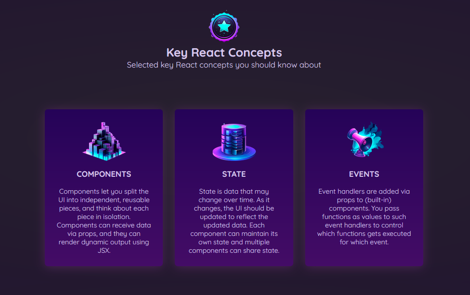

<h1 align="center">
  <br>
  <a href="#"></a>
  <br>
  Demo Project Section 7
  <br>
</h1>

<h4 align="center">A CSS styled Goal Tracker.</h4>

<p align="center">
  <a href="#">
    
  </a>
</p>

<p align="center">
  <a href="#prerequisites">Prerequisites</a> •
  <!-- <a href="#setup">Setup</a> • -->
  <a href="#how-to-use">How To Use</a> •
  <!-- <a href="#todo">Todo</a> • -->
  <a href="#support">Support</a> 
</p>



## Prerequisites
* [Git](https://git-scm.com)
* [Node.js](https://nodejs.org/en/download/)
* [npm](http://npmjs.com)

<!-- ## Setup -->

## How to Use

```bash
# Clone this repository
$ git clone https://github.com/ckarakoc/DemoProjectS7.git

# Install dependencies
$ npm install

# Run the app
$ npm start
```

<!-- ## TODO -->
<!-- *  -->

## Support

<a href="https://www.buymeacoffee.com/ckarakoc" target="_blank"></a>

## You may also like...

- [Codewars](https://github.com/ckarakoc/codewars/) - A Codewars Kata importer